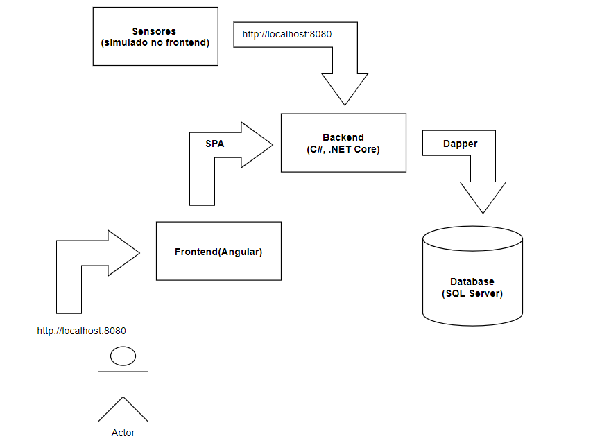
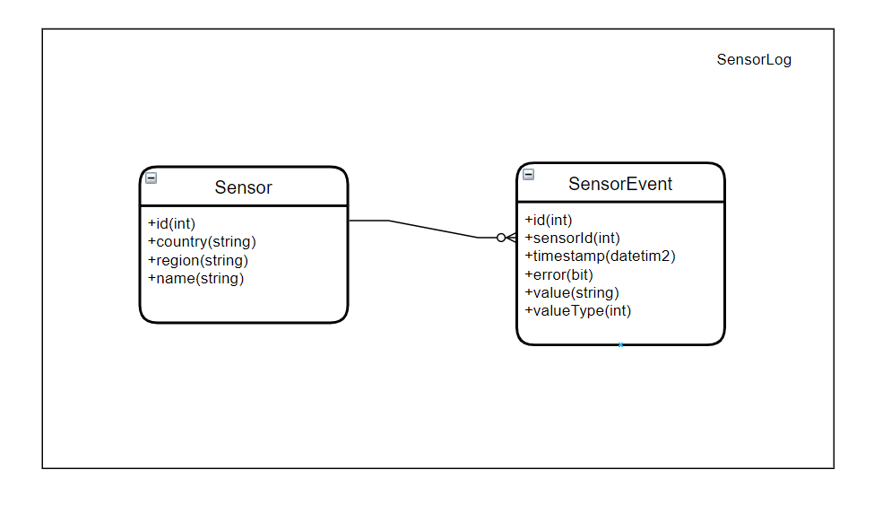
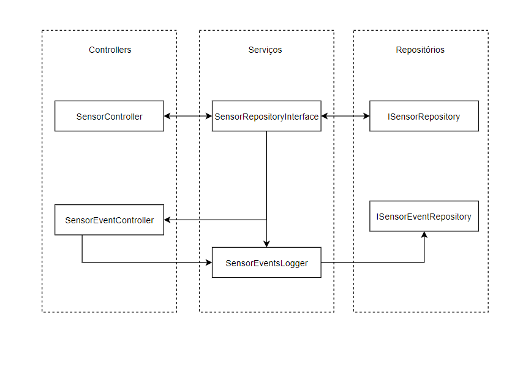

# Desafio para vaga de analista pleno/sênior


## Executando a solução

* **Pré-requisitos**: Docker e docker-compose intalados
* Entre na pasta `Challenge` através de algum shell e execute o comando

```
docker-compose up -d
```

* Aplicação estará disponível em http://localhost:8080
* **Observação**: após cadastrar sensores e sair da aplicação ou recarregar o SPA, é necessário entrar na página de adicionar sensor para iniciar o registro de novos eventos.

## Stack usada



### Persistência
Apesar do grande fluxo de dados, a quantidade de dados sendo escritos considerando o cenário informado ainda está num limite aceitável para um banco relacional de nível empresarial como Sql Server ou PostgreSQL.
Minha primeira escolha era o Postgres devido a ser open source, possuir licença permissiva e ainda ser comparável com outros pagos. Porém, devido a um problema com como o Dapper gera as queries para execução, haveria necessidade de abandonar alguns padrões de nomenclatura para fazer funcionar com o ORM (há uma issue aberta no repositório para verificar esse problema). Dado o limite de tempo e o escopo desse projeto, optei pelo Sql Server.
* Schema
  * Prevendo a grade quantidade de eventos a serem inseridas, uma entidade pra identificar um sensor foi criada. O schema criado é como mostrado na figura abaixo:



### ORM
Fiz algunss testes com o Entity Framework, porém, abandonei-o em favor do Dapper devido a minha maior familiaridade com o repository pattern. Novamente, dado as restrições achei que seria mais fácil asssim. Porém, vale mencionar que o Dapper acaba tendo uma performance, em geral, melhor que outros ORMs por ser bem mais enxuto ao custo de um código um pouco mais complexo de se dar manutenção.

### Frontend
Um SPA escrito em Angular foi escolhido para desenvolver o frontend. Alguns pontos sobre o frontend:
* Para fins de testes, os usuários precisam adicionar os sensores manualmente em http://localhost:8080/add-sensor
* O gráfico que registra os valores númericos salvos por sensor foi feito usando o Highcharts.js.
* Atualmente, a tabela de log de eventos é atualizada fazendo pooling do backend e pegando eventos que foram registrador após a última iteração.
* Há um serviço no frontend que simula a geração dos eventos. Para cada sensor registrado, é gerado um evento a cada 3 segundos.

### Backend

A aplicação está dividida em três grandes áreas: controllers, serviços e reposítórios. 
* **Controllers**: faz a comunicação com o frontend. Oferece operações de inserção e de listagem de recursos e acesso à funcionalidades mais avançadas
* **Serviços**: aplica a lógica de negócio aos dados recebidos
  * `SensorRepositoryInterface`: faz uma interface com o repositório de `Sensor` de modo a oferecer uma funcionalidade de caching de sensores. Essa decisão foi devido a utilização de uma tabela separada para representar sensores. Como cada `SensorEvent` precisa do id do `Sensor` associado, seria necessário buscar o `Sensor` no banco toda vez que um evento chegasse, o que pode pesar um pouco o banco. O cache foi modelado usando um `ConcurrentDictionary` estático. Funciona bem para quando há apenas uma instância da aplicação rodando. Pra múltiplas instâncias, já não é muito eficiente.
  * `SensorEventsLogger`: aplica as regras de interpretação e de registro de um evento do sensor
* **Repositórios**: fonte de consulta de dados



As setas indicam o fluxo de dados entre classes na aplicação.

## Testes
Foram feitos testes unitários que testam as regras de negócioem `SensorEventsLogger` e o caching em `SenorRepositoryInterface`.

## O que não deu tempo de implementar =/
* Devido ao fluxo contínuo de eventos gerados pelos sensores, seria interessante a utilização de websockets para minimizar o custo de comunicação entre sensor e servidor. O SignalR fornece um framework que simplifica bastante o processo de implementação de websockets.
* A tabela de log de eventos que o usuário pode acessar também se beneficiaria do uso de websockets. Como se trata de uma tabela que deve ser atualizada automaticamente, idealmente o servidor poderia enviar essa informação para o frontend assim que registrasse um novo evento.
* O cache de `Sensor`s como está atualmente não funciona de maneira eficiente quando há múltiplas instâncias da aplicação rodando. Por esse motivo, uma solução de cache distribuída, como, por exemplo, o Redis, seria mais adequado.
* Devido a algumas limitações do servidor Kestrel, seria interessante usar um proxy reverso na frente dele. Serviços como IIS, Apache ou Nginx são mais completos e podem simplifica o processo de load balancing e de configuração de comunicação segura.
* A interface está bem crua.